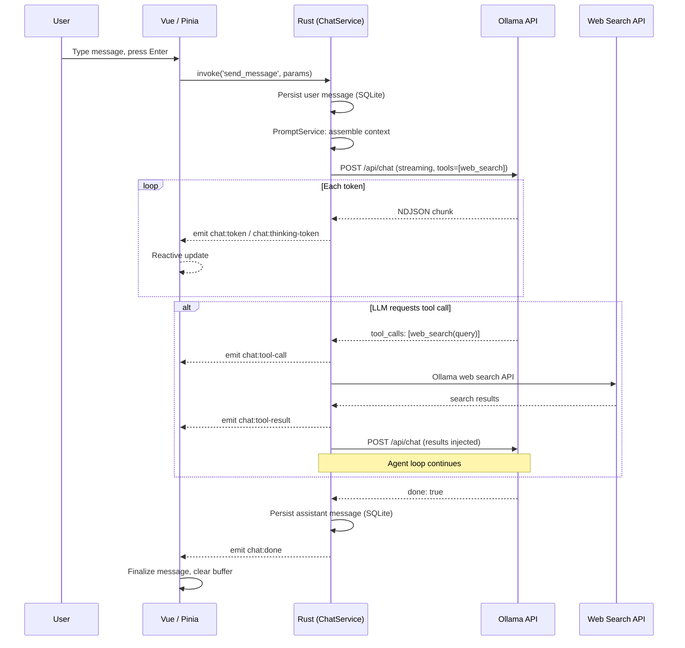
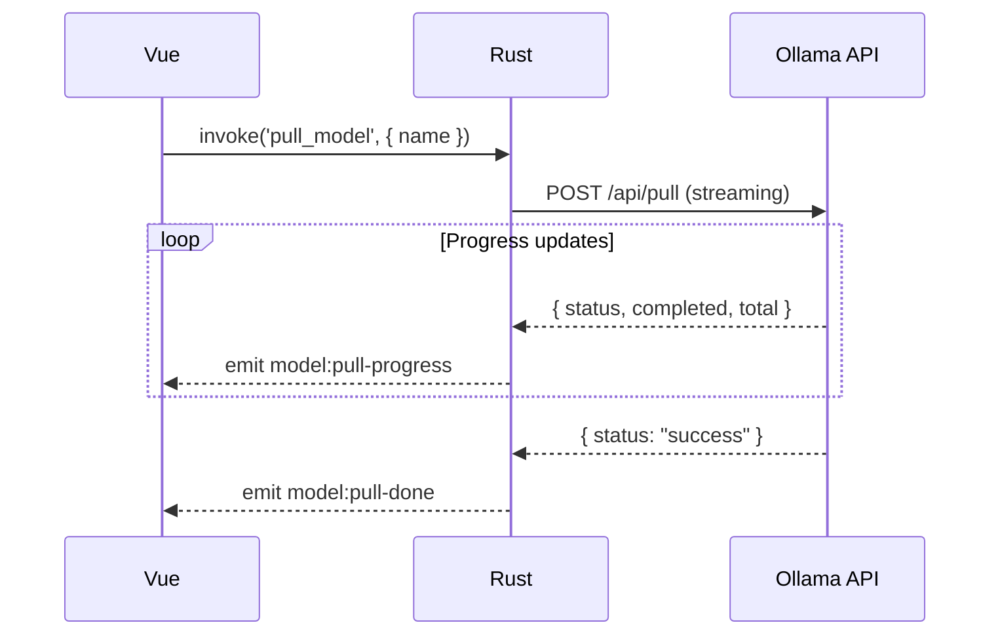
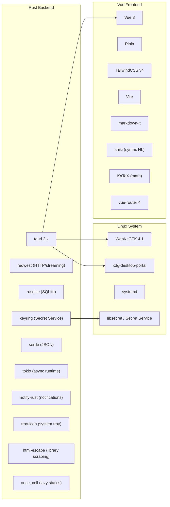

# Alpaka Desktop — Architecture Document

> **v1.2.0** — 2026-05-04
> Companion to [PRODUCT_SPEC.md](PRODUCT_SPEC.md)

---

## 1. High-Level Architecture

```
┌──────────────────────────────────────────────────────────────┐
│                      TAURI v2 PROCESS                        │
│                                                              │
│  ┌────────────────────────┐    ┌───────────────────────────┐ │
│  │   Vue 3 Frontend       │    │   Rust Backend            │ │
│  │   (WebKitGTK WebView)  │◄──►│   (Tauri Commands)        │ │
│  │                        │IPC │                           │ │
│  │  ┌──────────────────┐  │    │  ┌─────────────────────┐  │ │
│  │  │  Pinia Stores    │  │    │  │  Command Handlers   │  │ │
│  │  │  • chat          │  │    │  │  (commands/)        │  │ │
│  │  │  • models        │  │    │  ├─────────────────────┤  │ │
│  │  │  • hosts         │  │    │  │  Service Layer      │  │ │
│  │  │  • settings      │  │    │  │  • ChatService      │  │ │
│  │  │  • auth          │  │    │  │  • PromptService    │  │ │
│  │  │  • ui            │  │    │  │  • WebSearchService │  │ │
│  │  └──────────────────┘  │    │  │  • LibraryService   │  │ │
│  │                        │    │  ├─────────────────────┤  │ │
│  │  ┌──────────────────┐  │    │  │  Ollama Client      │  │ │
│  │  │  Composables     │  │    │  │  (ollama/)          │  │ │
│  │  │  17 composables  │  │    │  ├─────────────────────┤  │ │
│  │  └──────────────────┘  │    │  │  SQLite (db/)       │  │ │
│  └────────────────────────┘    │  ├─────────────────────┤  │ │
│                                │  │  Auth / Keyring     │  │ │
│                                │  ├─────────────────────┤  │ │
│                                │  │  System             │  │ │
│                                │  │  (tray, notifs,     │  │ │
│                                │  │   systemd)          │  │ │
│                                │  └─────────────────────┘  │ │
│                                └───────────────────────────┘ │
└──────────────────────────────────────────────────────────────┘
          │                              │
          ▼                              ▼
  ┌───────────────┐            ┌──────────────────┐
  │ Static Assets │            │  Ollama Hosts    │
  │ (Vite build)  │            │  • localhost     │
  └───────────────┘            │  • LAN servers   │
                               │  • Ollama Cloud  │
                               └──────────────────┘
```

### Architectural Style: **Modular Monolith (Desktop)**

A single-process Tauri v2 app with clean module boundaries in Rust. Tauri command handlers are thin adapters that delegate business logic to the service layer. The frontend is a single Vue 3 SPA rendered in WebKitGTK.

**Layering in the Rust backend:**
```
commands/ (Tauri IPC boundary)
    └── delegates to →
services/ (business logic: ChatService, PromptService, WebSearchService, LibraryService)
    └── delegates to →
ollama/client.rs (HTTP, streaming)
db/ (SQLite persistence)
auth/keyring.rs (Secret Service)
```

---

## 2. Project Structure

```
alpaka-desktop/
├── docs/
│   ├── ARCHITECTURE.md           # This file
│   └── PRODUCT_SPEC.md           # Feature matrix, UX, milestones
│
├── src-tauri/                    # Rust backend (Tauri v2)
│   ├── Cargo.toml
│   ├── tauri.conf.json           # Tauri v2 configuration
│   ├── capabilities/
│   │   └── default.json          # Tauri v2 capability permissions
│   ├── icons/
│   └── src/
│       ├── main.rs               # Binary entry point
│       ├── lib.rs                # App builder, command registry, setup
│       ├── state.rs              # AppState (shared across commands)
│       ├── error.rs              # Unified AppError type
│       │
│       ├── commands/             # Tauri IPC handlers — thin adapters only
│       │   ├── mod.rs
│       │   ├── auth/             # api_key + oauth subcommands
│       │   │   ├── api_key.rs    # set/get/delete/validate API key (keyring)
│       │   │   └── oauth.rs      # ollama signin polling, auth status probe
│       │   ├── chat.rs           # Conversations, messages, send, stop, export, compact
│       │   ├── chat.tests.rs     # Integration tests for chat commands
│       │   ├── folders.rs        # Folder context link/unlink/list/tokens
│       │   ├── hosts.rs          # Host CRUD, ping, 30 s health loop
│       │   ├── library.rs        # Ollama library search, tags, readme
│       │   ├── models.rs         # List, pull, delete, capabilities, modelfile
│       │   ├── model_create.rs   # create_model + cancel_model_create (streaming)
│       │   ├── model_path.rs     # validate_model_path + apply_model_path (systemd override)
│       │   ├── model_settings.rs # Per-model default options + ChatOptions validation
│       │   ├── model_updates.rs  # get_models_with_updates, check_model_updates (MO-09)
│       │   ├── model_user_data.rs# Favorites, tags
│       │   ├── proxy.rs          # get_proxy_config, save_proxy, delete_proxy, test_proxy
│       │   ├── service.rs        # Start/stop ollama systemd service
│       │   ├── settings.rs       # KV settings get/set/delete
│       │   ├── system.rs         # report_active_view, open_browser
│       │   └── system_info.rs    # detect_hardware (GPU/VRAM/RAM)
│       │
│       ├── services/             # Business logic layer
│       │   ├── mod.rs
│       │   ├── chat/             # ChatService split across files
│       │   │   ├── mod.rs        # SendParams, send() lifecycle
│       │   │   ├── compact.rs    # Conversation summarisation flow
│       │   │   ├── context.rs    # apply_sliding_window (0.85 × num_ctx)
│       │   │   └── orchestrator.rs # Agent loop (tool calls, max 5 iters)
│       │   ├── library.rs        # LibraryService: scrape ollama.com/library
│       │   ├── model_updates.rs  # ModelUpdateService: background 6h loop, digest comparison, do_update_check
│       │   ├── prompt.rs         # PromptService: context assembly, history
│       │   └── search.rs         # WebSearchService: tool call execution
│       │
│       ├── ollama/               # Ollama API client
│       │   ├── mod.rs
│       │   ├── client.rs         # HTTP client (reqwest), host routing
│       │   ├── streaming.rs      # NDJSON stream parser, think-tag detection
│       │   ├── types.rs          # API request/response types
│       │   └── search.rs         # Web search API integration
│       │
│       ├── db/                   # SQLite persistence layer
│       │   ├── mod.rs            # Connection pool, open(), DbConn type alias
│       │   ├── migrations.rs     # Single baseline migration runner
│       │   ├── repo.rs           # AssistantMetrics, shared query types
│       │   ├── conversations.rs  # Conversation CRUD
│       │   ├── messages.rs       # Message CRUD
│       │   ├── hosts.rs          # Host CRUD
│       │   ├── settings.rs       # Settings KV
│       │   ├── folders.rs        # Folder context records
│       │   └── sql/
│       │       └── 001_init_v1.sql  # v1.0.0 baseline schema (single file)
│       │
│       ├── auth/
│       │   ├── mod.rs
│       │   └── keyring.rs        # Secret Service API wrapper
│       │
│       └── system/
│           ├── mod.rs
│           ├── tray.rs           # System tray setup, icon theming
│           ├── notifications.rs  # Desktop notifications
│           └── systemd.rs        # systemctl commands
│
├── src/                          # Vue 3 frontend
│   ├── main.ts                   # App entry, Pinia init, router
│   ├── App.vue                   # Root component
│   ├── style.css                 # TailwindCSS v4 entry
│   │
│   ├── stores/                   # Pinia state management
│   │   ├── auth.ts               # Auth state, signin flow
│   │   ├── chat.ts               # Conversations, messages, streaming state
│   │   ├── hosts.ts              # Host list, active host, health status
│   │   ├── models.ts             # Model list, pull progress
│   │   ├── settings.ts           # User preferences
│   │   └── ui.ts                 # Sidebar, theme, compact mode
│   │
│   ├── composables/              # Vue 3 composition functions (17 total)
│   │   ├── useAppOrchestration.ts   # App-level init and lifecycle coordination
│   │   ├── useAttachments.ts        # Image picker / drag-drop / file→folder-context bridge
│   │   ├── useCollapsibleState.ts   # Think-block expand/collapse
│   │   ├── useConfirmationModal.ts  # Reusable destructive-action dialog
│   │   ├── useContextWindow.ts      # Context token budget tracking + ≥70 % flag
│   │   ├── useConversationLifecycle.ts  # Create/switch/delete conversations
│   │   ├── useCopyToClipboard.ts    # Clipboard write with feedback
│   │   ├── useDraftManager.ts       # Persist chat drafts via update_chat_draft
│   │   ├── useDraftSync.ts          # Per-conversation input + options autosave
│   │   ├── useKeyboard.ts           # Global keyboard shortcuts
│   │   ├── useModelCreate.ts        # Modelfile create flow + streaming events
│   │   ├── useModelDefaults.ts      # apply / save / reset per-model defaults
│   │   ├── useModelLibrary.ts       # Ollama library search + hardware ref
│   │   ├── useSendMessage.ts        # Message send + stop orchestration
│   │   ├── useStreaming.ts          # Streaming state accumulation
│   │   ├── useStreamingEvents.ts    # Raw Tauri event listener setup
│   │   └── useUndoHistory.ts        # Custom Ctrl+Z / Shift+Z stack for chat input
│   │
│   ├── components/
│   │   ├── chat/
│   │   │   ├── ChatView.vue          # Virtualised message list (vue-virtual-scroller)
│   │   │   ├── MessageBubble.vue     # Markdown + think + code + tool-call rendering
│   │   │   ├── ThinkBlock.vue
│   │   │   ├── CodeBlock.vue
│   │   │   ├── SearchBlock.vue       # Web search tool-call results
│   │   │   ├── StatsBlock.vue        # Per-message metrics
│   │   │   ├── ChatInput.vue
│   │   │   ├── StreamIndicator.vue
│   │   │   ├── TypingIndicator.vue
│   │   │   └── input/
│   │   │       ├── AdvancedChatOptions.vue
│   │   │       ├── AttachMenu.vue
│   │   │       ├── AttachmentList.vue
│   │   │       ├── ContextBar.vue
│   │   │       ├── ContextPill.vue
│   │   │       ├── ModelSelector.vue
│   │   │       └── SystemPromptPanel.vue
│   │   ├── hosts/
│   │   │   └── HostManager.vue       # ⚠️ Defined but never imported as of v1.2.0
│   │   ├── models/
│   │   │   ├── CloudTagSelector.vue
│   │   │   ├── CreateModelPage.vue   # Modelfile create / edit page
│   │   │   ├── LibraryApplications.vue
│   │   │   ├── LibraryBrowser.vue
│   │   │   ├── LibraryModelDetails.vue
│   │   │   ├── LocalModelDetails.vue
│   │   │   └── ModelCard.vue
│   │   ├── settings/
│   │   │   ├── AccountSettings.vue   # OAuth signin + API key panel
│   │   │   ├── ApiKeyPanel.vue
│   │   │   ├── GpuLayersSettings.vue # num_gpu input + detect_hardware summary (Settings → Engine)
│   │   │   ├── HostSettings.vue      # Host CRUD lives here, not in HostManager.vue
│   │   │   ├── ProxySettings.vue     # HTTP/SOCKS5 proxy config (URL, username, keyring password)
│   │   │   ├── ModelPathSettings.vue
│   │   │   ├── PresetEditor.vue
│   │   │   ├── SettingsRow.vue
│   │   │   ├── SettingsSlider.vue
│   │   │   └── StopSequencesInput.vue
│   │   ├── shared/
│   │   │   ├── AppTabs.vue
│   │   │   ├── BaseModal.vue
│   │   │   ├── ConfirmationModal.vue
│   │   │   ├── CustomTooltip.vue
│   │   │   ├── ErrorScreen.vue       # ⚠️ Defined but never imported as of v1.2.0
│   │   │   ├── MirostatSelector.vue
│   │   │   ├── ModelTagBadge.vue
│   │   │   ├── ToggleSwitch.vue
│   │   │   ├── TopBar.vue            # ⚠️ 0-byte placeholder; layout lives in App.vue
│   │   │   └── icons/
│   │   └── sidebar/
│   │       ├── Sidebar.vue           # ⚠️ Search input on line 43 is unwired
│   │       └── ConversationList.vue  # Real conversation search lives here (Ctrl+K)
│   │
│   ├── views/
│   │   ├── ChatPage.vue           # Main chat view
│   │   ├── LaunchPage.vue         # Static `ollama launch <tool>` reference cards
│   │   ├── ModelsPage.vue         # Library + local + create-model
│   │   └── SettingsPage.vue       # 7 tabs: General / Connection / Engine / Prompts / Account / Maintenance / Advanced
│   │
│   ├── lib/
│   │   ├── tauri.ts               # Typed invoke() wrappers
│   │   ├── markdown.ts            # markdown-it + Shiki + KaTeX pipeline
│   │   └── constants.ts
│   │
│   ├── router/                    # Vue Router routes
│   └── types/                     # Shared TypeScript types
│       ├── chat.ts
│       ├── hosts.ts
│       ├── models.ts
│       └── settings.ts
│
├── packaging/
│   ├── aur/PKGBUILD              # alpaka-desktop-bin (pre-built binary)
│   └── aur-git/PKGBUILD          # alpaka-desktop-git (build from source)
│
├── .github/
│   ├── ISSUE_TEMPLATE/
│   │   ├── bug_report.yml
│   │   └── feature_request.yml
│   └── workflows/
│       └── release.yml           # Build + publish on v* tag push
│
├── index.html
├── vite.config.ts
├── tsconfig.json
├── package.json
├── README.md
├── LICENSE
└── CONTRIBUTING.md
```

---

## 3. Rust Backend — Tauri Commands

All IPC between frontend and backend uses Tauri v2's `#[tauri::command]` system. Commands are async and return `Result<T, AppError>`.

### 3.1 Command Registry

The complete handler list registered in `src-tauri/src/lib.rs`:

```rust
tauri::generate_handler![
    // ── Chat ──────────────────────────────────────────────────────────────
    commands::chat::get_messages,
    commands::chat::create_conversation,
    commands::chat::list_conversations,
    commands::chat::delete_conversation,
    commands::chat::update_conversation_title,
    commands::chat::set_conversation_pinned,
    commands::chat::update_system_prompt,
    commands::chat::update_chat_draft,
    commands::chat::send_message,          // delegates to ChatService::send()
    commands::chat::stop_generation,
    commands::chat::export_conversation,
    commands::chat::backup_database,
    commands::chat::restore_database,
    commands::chat::compact_conversation,  // delegates to ChatService::compact()

    // ── Models ────────────────────────────────────────────────────────────
    commands::models::list_models,
    commands::models::delete_model,
    commands::models::pull_model,          // streams model:pull-progress events
    commands::models::get_model_capabilities,
    commands::models::get_modelfile,       // fetches Modelfile for existing model via /api/show
    commands::models::create_model,        // streams model:create-* events via /api/create
    commands::models::cancel_model_create, // cancels in-progress model creation by name
    commands::model_user_data::toggle_model_favorite,
    commands::model_user_data::set_model_tags,
    commands::model_user_data::list_model_user_data,

    // ── Hosts ─────────────────────────────────────────────────────────────
    commands::hosts::list_hosts,
    commands::hosts::add_host,
    commands::hosts::update_host,
    commands::hosts::delete_host,
    commands::hosts::set_active_host,
    commands::hosts::ping_host,

    // ── Auth ──────────────────────────────────────────────────────────────
    commands::auth::login,                 // stores token in keyring
    commands::auth::logout,                // runs ollama signout + clears keyring
    commands::auth::get_auth_status,       // active probe: keyring + ed25519 + daemon
    commands::auth::check_ollama_signed_in, // checks ~/.ollama/id_ed25519 existence
    commands::auth::trigger_ollama_signin, // spawns `ollama signin`, returns OAuth URL

    // ── Settings ──────────────────────────────────────────────────────────
    commands::settings::get_setting,
    commands::settings::set_setting,
    commands::settings::get_all_settings,
    commands::settings::delete_setting,
    commands::settings::delete_all_settings,

    // ── Proxy ─────────────────────────────────────────────────────────────
    commands::proxy::get_proxy_config,  // returns { proxy_url, username, has_password }
    commands::proxy::save_proxy,        // saves URL+username to DB, password to keyring, rebuilds client
    commands::proxy::delete_proxy,      // clears all proxy config, rebuilds client without proxy
    commands::proxy::test_proxy,        // probes active host /api/version via a temporary proxy client

    // ── Folder Context ────────────────────────────────────────────────────
    commands::folders::link_folder,
    commands::folders::unlink_folder,
    commands::folders::get_folder_contexts,
    commands::folders::list_folder_files,
    commands::folders::update_included_files,
    commands::folders::estimate_tokens,

    // ── Ollama Library ────────────────────────────────────────────────────
    commands::library::search_ollama_library,
    commands::library::get_library_tags,
    commands::library::get_library_model_readme,

    // ── Service (systemd) ─────────────────────────────────────────────────
    commands::service::start_ollama,
    commands::service::stop_ollama,
    commands::service::ollama_service_status,

    // ── System ────────────────────────────────────────────────────────────
    commands::system_info::detect_hardware,  // reads /proc/meminfo + DRM sysfs
    commands::system::report_active_view,    // tracks current page for tray
    commands::system::open_browser,          // opens URL via xdg-open
]
```

### 3.2 Shared Application State

```rust
// src-tauri/src/state.rs
pub struct AppState {
    /// Arc<Mutex<Connection>> — cloneable, passed into spawn_blocking tasks.
    pub db: DbConn,

    /// Path to the SQLite database file (used by backup_database).
    pub db_path: PathBuf,

    /// Shared reqwest HTTP client wrapped in RwLock for runtime proxy switching.
    /// Rebuilt by `save_proxy` / `delete_proxy` without app restart.
    /// `build_http_client(proxy_url, username, password)` creates the client with
    /// optional HTTP or SOCKS5 proxy support.
    pub http_client: RwLock<reqwest::Client>,

    /// Send on this channel to interrupt an in-progress generation.
    /// None when no generation is running.
    pub cancel_tx: Mutex<Option<broadcast::Sender<()>>>,

    /// Shutdown signal for the host health loop background task.
    pub health_loop_shutdown: Mutex<Option<tokio::sync::oneshot::Sender<()>>>,

    /// Join handle for the host health loop task.
    pub health_loop_handle: Mutex<Option<tauri::async_runtime::JoinHandle<()>>>,

    /// True while the user is on a chat-related page (used by tray).
    pub is_chat_view: Mutex<bool>,

    /// ID of the conversation currently visible (used by tray notifications).
    pub active_conversation_id: Mutex<Option<String>>,
}
```

`DbConn` is a type alias for `Arc<Mutex<rusqlite::Connection>>`. Rust database calls go through `tokio::task::spawn_blocking` to avoid blocking the async runtime.

### 3.3 IoC Pattern — Core Functions

Many commands have a `core_*` counterpart that accepts plain dependencies instead of `State<'_, AppState>`. This enables unit testing without a running Tauri instance:

```rust
// The Tauri command — thin adapter:
#[tauri::command]
pub async fn list_hosts(state: State<'_, AppState>) -> Result<Vec<Host>, AppError> {
    core_list_hosts(state.db.clone()).await
}

// The testable core function:
pub async fn core_list_hosts(db: DbConn) -> Result<Vec<Host>, AppError> {
    tokio::task::spawn_blocking(move || {
        let conn = db.lock().map_err(|_| AppError::Db("lock poisoned".into()))?;
        db::hosts::list_all(&conn)
    }).await.map_err(|e| AppError::Internal(e.to_string()))?
}
```

### 3.4 Authentication Flow

The authentication system uses a **polling-based flow** for Ollama Cloud sign-in:

```
Frontend                          Rust Backend                 System
   │                                    │                        │
   │ invoke('trigger_ollama_signin')     │                        │
   │───────────────────────────────────►│                        │
   │                                    │ spawn_blocking:        │
   │                                    │ `ollama signin`        │
   │                                    │───────────────────────►│
   │                                    │                        │ outputs https://ollama.com/connect?...
   │◄───────────────────────────────────│                        │
   │ Returns OAuth URL string           │                        │
   │                                    │                        │
   │ open URL in browser                │                        │
   │ start polling (1s interval)        │                        │
   │                                    │                        │
   │ invoke('get_auth_status', host_id) │                        │
   │───────────────────────────────────►│                        │
   │                                    │ check keyring          │
   │                                    │ check ~/.ollama/id_ed25519
   │                                    │ active probe: POST /api/experimental/web_search
   │◄───────────────────────────────────│                        │
   │ Returns bool (true = authenticated)│                        │
   │                                    │                        │
   │ (keep polling until true)          │                        │
```

`get_auth_status` performs a three-step active probe:
1. Check system keyring for a stored token (skips legacy sentinel "native-ssh-session")
2. Check for `~/.ollama/id_ed25519` (ed25519 key written by `ollama signin`)
3. POST to `/api/experimental/web_search` — if the daemon returns 401, report unauthenticated

---

## 4. Tauri Event System — Streaming Architecture

### 4.1 Event Flow

```
Ollama API ──(NDJSON stream)──► Rust (reqwest bytes_stream)
                                       │
                              parse each NDJSON chunk
                                       │
                           ┌───────────▼────────────┐
                           │   streaming.rs          │
                           │   detect <think> tags   │
                           │   detect tool calls     │
                           └───────────┬────────────┘
                                       │ app.emit(event, payload)
                                       │
                             Tauri event bus (IPC)
                                       │
                           ┌───────────▼────────────┐
                           │   useStreamingEvents.ts │
                           │   listen(event, handler)│
                           └───────────┬────────────┘
                                       │
                            Pinia store update
                                       │
                              Vue reactivity → DOM
```

### 4.2 Event Catalog

| Event | Direction | Payload | Description |
|---|---|---|---|
| `chat:token` | Rust → Vue | `{ conversation_id, content }` | Single text chunk during generation |
| `chat:thinking-start` | Rust → Vue | `{ conversation_id }` | Opening `<think>` tag detected |
| `chat:thinking-token` | Rust → Vue | `{ conversation_id, content }` | Token inside a `<think>` block |
| `chat:thinking-end` | Rust → Vue | `{ conversation_id }` | Closing `</think>` tag detected |
| `chat:done` | Rust → Vue | `{ conversation_id, total_tokens?, duration_ms?, tokens_per_sec?, seed? }` | Generation complete, message persisted; `seed` present only when a fixed seed was used |
| `chat:error` | Rust → Vue | `{ conversation_id, error }` | Stream or generation error |
| `chat:tool-call` | Rust → Vue | `{ conversation_id, tool_name, arguments }` | LLM requested a tool call (web search) |
| `chat:tool-result` | Rust → Vue | `{ conversation_id, tool_name, result }` | Tool call result returned to LLM |
| `model:pull-progress` | Rust → Vue | `{ model, status, completed?, total?, percent? }` | Download progress chunk |
| `model:pull-done` | Rust → Vue | `{ model }` | Model download complete |
| `model:updates-checked` | Rust → Vue | `{ outdated: string[] }` | Background update check result; names of locally installed models with newer versions on ollama.com |
| `model:create-progress` | Rust → Vue | `{ model: string, status: string }` | Model creation progress status line |
| `model:create-done` | Rust → Vue | `{ model: string }` | Model creation complete |
| `model:create-error` | Rust → Vue | `{ model: string, error: string, cancelled: boolean }` | Model creation failed or cancelled |
| `host:status-change` | Rust → Vue | `{ host_id, status, latency_ms? }` | Periodic health check result |

### 4.3 Why Tauri Events over WebSockets/SSE

| Approach | Verdict | Reasoning |
|---|---|---|
| **Tauri Events** ✅ | **Chosen** | Native IPC, zero overhead; no port binding; works through `app.emit()` / `listen()`; built-in cancellation via `broadcast` channel |
| WebSockets | Rejected | Requires spawning a WS server in Rust, binding a port, managing lifecycle |
| SSE (frontend direct) | Rejected | Frontend can't access keyring, SQLite, or system services; violates Tauri's security model |

---

## 5. Frontend State Management (Pinia)

### 5.1 Store Architecture

```
┌──────────────────────────────────────────────────────┐
│                    Pinia Root                        │
│                                                      │
│  ┌─────────┐  ┌──────────┐  ┌──────────┐           │
│  │chatStore│  │modelStore│  │hostStore │           │
│  │         │  │          │  │          │           │
│  │ convs[] │  │ models[] │  │ hosts[]  │           │
│  │ active  │  │ pulling  │  │ active   │           │
│  │ stream  │  │ progress │  │ health{} │           │
│  └────┬────┘  └────┬─────┘  └────┬─────┘           │
│       │             │             │                  │
│  ┌────┴────┐  ┌─────┴────┐  ┌────┴──────┐          │
│  │settings │  │authStore │  │  uiStore  │          │
│  │Store    │  │          │  │           │          │
│  │ prefs{} │  │ signedIn │  │ sidebar   │          │
│  │         │  │ authUrl  │  │ theme     │          │
│  │         │  │ polling  │  │ compact   │          │
│  └─────────┘  └──────────┘  └───────────┘          │
└──────────────────────────────────────────────────────┘
```

### 5.2 Composable Responsibilities

| Composable | Responsibility |
|---|---|
| `useAppOrchestration` | App-level init: loads stores, starts event listeners, seeds default host |
| `useStreamingEvents` | Registers all Tauri event listeners (`chat:token`, `chat:thinking-*`, `chat:tool-*`, etc.) |
| `useStreaming` | Accumulates streaming buffer, manages `isThinking` state machine, exposes `promptTokens` / `evalTokens` |
| `useSendMessage` | Orchestrates send + stop generation; validates input, calls `chatStore`, handles errors |
| `useConversationLifecycle` | Create / switch / delete conversations, title auto-generation |
| `useDraftManager` | Persists raw chat-input drafts per-conversation via `update_chat_draft` |
| `useDraftSync` | Higher-level draft sync for input + advanced options + attachments + presets |
| `useContextWindow` | Tracks effective `num_ctx`, computed token usage (input + attachments + system + history), `≥70 %` flag for the Compact button |
| `useAttachments` | Image picker / drag-drop; non-image drops are forwarded to `link_folder` as folder context. **No clipboard paste** — removed in v1.2.0 |
| `useModelLibrary` | Searches Ollama library, fetches model tags and README, holds `hardware` ref from `detect_hardware` |
| `useModelDefaults` | Apply / save / reset per-model default `ChatOptions` |
| `useModelCreate` | Streaming create-model lifecycle (start / cancel / progress / done / error) |
| `useUndoHistory` | Custom undo/redo stack for the chat input — required because WebKitGTK on Wayland doesn't drive native undo for `v-model`-controlled `<textarea>` |
| `useKeyboard` | Global shortcuts (Esc, Ctrl+/, Ctrl+,, Ctrl+H, Ctrl+N, Ctrl+K, Ctrl+M, Ctrl+Shift+M, Ctrl+Shift+C, Ctrl+↑/↓) |
| `useCollapsibleState` | Expand/collapse state for `ThinkBlock` and `SearchBlock` panels |
| `useConfirmationModal` | Shared destructive-action confirmation dialog |
| `useCopyToClipboard` | Clipboard write with 2 s feedback flash |

### 5.3 Frontend Token Rendering Strategy

60 FPS streaming is achieved through:

1. **Buffered rendering**: Tokens accumulate in a reactive string via `useStreaming`. `MessageBubble` re-renders on each update.
2. **Incremental markdown**: `markdown-it` processes the full buffer on each token (fast for small deltas). Completed paragraphs are cached.
3. **Separate think buffer**: `chat:thinking-token` events populate a separate `thinkingBuffer` — the main response buffer is not polluted.
4. **`requestAnimationFrame` batching**: Token events arriving faster than 60fps are batched into single reactive updates.

---

## 6. Services Layer

The `services/` directory owns business logic. Command handlers are thin adapters; all substantive work happens here.

### 6.1 ChatService (`services/chat/`)

Split into four files: `mod.rs` (entry + `send()`), `context.rs` (sliding window),
`compact.rs` (summarisation), `orchestrator.rs` (agent loop).

```rust
pub struct SendParams {
    pub conversation_id: String,
    pub content: String,
    pub base64_images: Option<Vec<String>>,
    pub model: String,
    pub folder_context: Option<String>,
    pub web_search_enabled: bool,
    pub think_mode: Option<String>,
    pub chat_options: Option<ChatOptions>,
    pub original_content: String,
}

impl<R: Runtime> ChatService<'_, R> {
    /// Full send lifecycle:
    /// 1. Persist user message to SQLite (off-main-thread via spawn_db)
    /// 2. Inject web_search system prompt + folder_context as system messages
    /// 3. Merge chat_options with global ChatOptions (custom wins, falls back to global)
    /// 4. Apply sliding-window truncation: trim oldest non-system messages
    ///    until total estimated tokens ≤ 0.85 × num_ctx
    /// 5. Call orchestrator.rs (agent loop, max 5 iterations, tool calls)
    /// 6. Persist assistant response (with metrics) to SQLite
    /// 7. Emit chat:done
    pub async fn send(&self, params: SendParams) -> Result<(), AppError>;

    /// Compact a conversation:
    /// 1. Load full history + old title
    /// 2. Build dialogue string from user/assistant turns only
    /// 3. Non-streaming Ollama call (temperature=0.3) with the summary prompt
    /// 4. Create a new conversation titled "Compact: <oldTitle>"
    /// 5. Set summary as the new conversation's system prompt
    /// 6. Copy the last 4 user/assistant messages, clearing prompt_tokens
    /// 7. Return the new conversation id
    pub async fn compact(&self, params: CompactParams) -> Result<String, AppError>;
}
```

Sliding-window logic (`services/chat/context.rs`): walks history in reverse,
estimating tokens as `content.len() / 4`, accumulating until `budget` is
reached. System messages at the head of the message list are always preserved.

### 6.2 PromptService (`services/prompt.rs`)

Builds the ordered message list sent to the LLM:

1. Global system prompt (from settings)
2. Per-conversation system prompt (stored as a `system` role message)
3. Folder context injection (file contents prepended as a system message)
4. Conversation history (with sliding-window truncation applied by ChatService)
5. Current user message

### 6.3 WebSearchService (`services/search.rs`)

Handles the web search tool-call agentic loop:

```rust
impl WebSearchService {
    /// Executes tool calls returned by the LLM.
    /// Currently supports: web_search
    /// Emits chat:tool-call and chat:tool-result events.
    pub async fn handle_tool_calls(
        &self,
        conversation_id: &str,
        tool_calls: Vec<ToolCall>,
        client: &OllamaClient,
    ) -> Result<(Vec<Message>, bool, Vec<(ToolCall, String)>), AppError>
}
```

Flow: LLM returns `tool_calls` → WebSearchService executes each → results appended to message history → LLM called again with results (agent loop).

### 6.4 LibraryService (`services/library.rs`)

Scrapes `ollama.com/library` for model discovery. Returns `LibraryModel` (name, slug, description, tags, pull_count) and `LibraryTag` structs. Used by the Models page library browser.

---

## 7. Ollama API Client — Host Routing

### 7.1 Multi-Host Architecture

All Ollama API calls route through `OllamaClient`, which resolves the currently active host at call time. Switching hosts is a DB write that takes effect on the next API call — no restart required.

```rust
pub struct OllamaClient {
    http: reqwest::Client,
    db: DbConn,  // reads active host URL from DB on each call
}
```

### 7.2 Cloud vs Local API Routing

| Destination | Host URL | Auth | Notes |
|---|---|---|---|
| Local Ollama | `http://localhost:11434` | None | Default, no auth needed |
| LAN Server | `http://192.168.x.x:11434` | Optional bearer | User-configured |
| Ollama Cloud | `https://api.ollama.com` | Required (OAuth/API key) | Token injected from keyring |

---

## 8. Security Architecture

### 8.1 Secrets Storage

```
┌──────────────┐     D-Bus      ┌─────────────────────┐
│ Rust Backend │◄──────────────►│ Secret Service API  │
│ (keyring     │                │                     │
│  crate)      │                │ ┌─────────────────┐ │
└──────────────┘                │ │ KWallet (KDE)   │ │
                                │ │ GNOME Keyring   │ │
                                │ │ KeePassXC       │ │
                                │ └─────────────────┘ │
                                └─────────────────────┘
```

**Stored in keyring:**
- OAuth access/refresh tokens (Ollama Cloud)
- Per-host bearer tokens (optional)

**Stored in SQLite (NOT secrets):**
- Conversations, messages, settings, host metadata (URLs, names), folder contexts, model cache

**Never stored:**
- Raw API keys in plaintext anywhere on disk
- Auth tokens in SQLite

### 8.2 Tauri v2 Capability Model

```json
// src-tauri/capabilities/default.json
{
  "permissions": [
    "core:default",
    "dialog:default",
    "fs:read-files",
    "fs:scope-download",
    "notification:default",
    "global-shortcut:default",
    "shell:default"
  ]
}
```

- **Scoped filesystem**: Frontend reads files only through `dialog:open` (user-selected) or explicitly scoped paths
- **CSP headers**: No inline scripts, no external resource loading from WebView
- **No arbitrary shell**: `systemctl` calls go through explicit Rust commands with hardcoded arguments

---

## 9. Data Flow Diagrams

### 9.1 Chat Message Flow (with web search)



### 9.2 Model Pull Flow



---

## 10. SQLite Schema

All persistence uses `rusqlite` with WAL mode:

```rust
// src-tauri/src/db/mod.rs
pub fn open(app_data_dir: &Path) -> Result<DbConn> {
    let db_path = app_data_dir.join("alpaka-desktop.db");
    let conn = Connection::open(&db_path)?;
    conn.execute_batch("PRAGMA journal_mode=WAL; PRAGMA foreign_keys=ON;")?;
    migrations::run(&conn)?;
    Ok(Arc::new(Mutex::new(conn)))
}
```

### 10.1 v1.0.0 Baseline Schema

All schema is defined in a single file: `src-tauri/src/db/sql/001_init_v1.sql`. This replaces the 9-file incremental migration history from development (v1–v9 squashed at v1.0.0 release).

```sql
-- conversations
CREATE TABLE IF NOT EXISTS conversations (
    id              TEXT    PRIMARY KEY NOT NULL,   -- UUID v4
    title           TEXT    NOT NULL DEFAULT 'New Chat',
    model           TEXT    NOT NULL DEFAULT '',
    system_prompt   TEXT    NOT NULL DEFAULT '',   -- retained column; effective prompt is a system message
    settings_json   TEXT    NOT NULL DEFAULT '{}', -- ChatOptions JSON blob
    pinned          INTEGER NOT NULL DEFAULT 0,
    tags            TEXT    NOT NULL DEFAULT '',
    draft_json      TEXT,                          -- persistent chat input draft
    created_at      TEXT    NOT NULL DEFAULT (strftime('%Y-%m-%dT%H:%M:%SZ', 'now')),
    updated_at      TEXT    NOT NULL DEFAULT (strftime('%Y-%m-%dT%H:%M:%SZ', 'now'))
);

-- messages
CREATE TABLE IF NOT EXISTS messages (
    id                      TEXT    PRIMARY KEY NOT NULL,
    conversation_id         TEXT    NOT NULL REFERENCES conversations(id) ON DELETE CASCADE,
    role                    TEXT    NOT NULL CHECK (role IN ('user', 'assistant', 'system')),
    content                 TEXT    NOT NULL DEFAULT '',
    images_json             TEXT    NOT NULL DEFAULT '[]',
    files_json              TEXT    NOT NULL DEFAULT '[]',
    tokens_used             INTEGER,
    generation_time_ms      INTEGER,
    prompt_tokens           INTEGER,
    tokens_per_sec          REAL,
    total_duration_ms       INTEGER,
    load_duration_ms        INTEGER,
    prompt_eval_duration_ms INTEGER,
    eval_duration_ms        INTEGER,
    created_at              TEXT    NOT NULL DEFAULT (strftime('%Y-%m-%dT%H:%M:%SZ', 'now'))
);

-- settings (key-value)
CREATE TABLE IF NOT EXISTS settings (
    key   TEXT PRIMARY KEY NOT NULL,
    value TEXT NOT NULL DEFAULT ''
);

-- hosts
CREATE TABLE IF NOT EXISTS hosts (
    id               TEXT    PRIMARY KEY NOT NULL,
    name             TEXT    NOT NULL,
    url              TEXT    NOT NULL,
    is_default       INTEGER NOT NULL DEFAULT 0,
    is_active        INTEGER NOT NULL DEFAULT 0,
    last_ping_status TEXT    NOT NULL DEFAULT 'unknown'
        CHECK (last_ping_status IN ('online', 'offline', 'unknown')),
    last_ping_at     TEXT,
    created_at       TEXT    NOT NULL DEFAULT (strftime('%Y-%m-%dT%H:%M:%SZ', 'now'))
    -- auth_token intentionally absent: stored in system keyring, never in SQLite
);

-- model_cache
CREATE TABLE IF NOT EXISTS model_cache (
    name              TEXT    PRIMARY KEY NOT NULL,
    host_id           TEXT    NOT NULL REFERENCES hosts(id) ON DELETE CASCADE,
    size_bytes        INTEGER NOT NULL DEFAULT 0,
    family            TEXT    NOT NULL DEFAULT '',
    parameters        TEXT    NOT NULL DEFAULT '',
    quantization      TEXT    NOT NULL DEFAULT '',
    capabilities_json TEXT    NOT NULL DEFAULT '[]',
    last_synced_at    TEXT    NOT NULL DEFAULT (strftime('%Y-%m-%dT%H:%M:%SZ', 'now'))
);

-- model_user_data
CREATE TABLE IF NOT EXISTS model_user_data (
    name        TEXT    PRIMARY KEY NOT NULL,
    is_favorite INTEGER NOT NULL DEFAULT 0,
    tags_json   TEXT    NOT NULL DEFAULT '[]',
    updated_at  TEXT    NOT NULL DEFAULT (strftime('%Y-%m-%dT%H:%M:%SZ', 'now'))
);

-- folder_contexts
CREATE TABLE IF NOT EXISTS folder_contexts (
    id                  TEXT    PRIMARY KEY NOT NULL,
    conversation_id     TEXT    NOT NULL REFERENCES conversations(id) ON DELETE CASCADE,
    path                TEXT    NOT NULL,
    included_files_json TEXT,
    auto_refresh        INTEGER NOT NULL DEFAULT 0,
    estimated_tokens    INTEGER NOT NULL DEFAULT 0,
    created_at          TEXT    NOT NULL DEFAULT (strftime('%Y-%m-%dT%H:%M:%SZ', 'now')),
    UNIQUE(conversation_id, path)
);
```

The migration runner (`migrations.rs`) applies this file on first run, recording version 1 in `schema_versions`. Future schema changes add new numbered entries to `MIGRATIONS`.

---

## 11. Background Services

### 11.1 Host Health Pinger

Spawned at app startup, shut down cleanly via `health_loop_shutdown` oneshot channel:

```rust
// Pings all hosts every 30 seconds
async fn host_health_loop(app: AppHandle, state: Arc<AppState>, shutdown: oneshot::Receiver<()>) {
    loop {
        tokio::select! {
            _ = shutdown => break,
            _ = tokio::time::sleep(Duration::from_secs(30)) => {
                let hosts = db::hosts::list_all(&state.db);
                for host in hosts {
                    let (status, latency_ms) = perform_ping(&state.http_client, &host.url).await;
                    db::hosts::update_ping_status(&state.db, &host.id, &status);
                    app.emit("host:status-change", json!({
                        "host_id": host.id,
                        "status": status,
                        "latency_ms": latency_ms,
                    }));
                }
            }
        }
    }
}
```

### 11.2 Generation Cancellation

Stop generation uses a `tokio::sync::broadcast` channel stored in `AppState::cancel_tx`. `send_message` subscribes a receiver before starting the stream; `stop_generation` sends on the channel. The streaming loop uses `tokio::select!` to race the cancel signal against the next NDJSON chunk.

---

## 12. ADR Summary

| # | Decision | Rationale |
|---|---|---|
| ADR-01 | **Tauri events** for streaming (not WS/SSE) | Native IPC, zero overhead, built-in cancellation |
| ADR-02 | **Pinia** for state management | Official Vue 3 store, TypeScript-native, simple API |
| ADR-03 | **rusqlite** (not SQLx/Diesel) | Sync API fits Tauri's threading model; WAL mode; embedded |
| ADR-04 | **keyring crate** for secrets | DE-agnostic via Secret Service API; never plaintext |
| ADR-05 | **reqwest** for HTTP | Async, streaming support, rustls TLS, mature |
| ADR-06 | **tokio::select!** for stream cancellation | Instant stop-generation without aborting the async task |
| ADR-07 | **Single shared `AppState`** (not per-command) | Tauri's `manage()` pattern; simple ownership model |
| ADR-08 | **Embedded single-file migration** | Desktop app — no CLI migrations; auto-apply at startup; squashed to one file at v1.0.0 |
| ADR-09 | **`markdown-it` + incremental rendering** | Processes full buffer on each token; avoids streaming parser complexity |
| ADR-10 | **Polling-based auth** (not callback/redirect) | `ollama signin` opens browser externally; frontend polls `get_auth_status` until keyring + ed25519 key confirmed |
| ADR-11 | **Services layer** (`services/`) | Keeps command handlers as thin IPC adapters; concentrates business logic in testable pure functions |
| ADR-12 | **IoC `core_*` functions** for testability | Commands delegate to `core_*` variants that accept plain `DbConn` + `reqwest::Client` — no Tauri state required for unit tests |

---

## 13. Performance Budget

| Component | Budget | Measured | Strategy |
|---|---|---|---|
| App cold start | < 2s | **0.21s** | Lazy-load non-critical routes; preload SQLite at setup |
| Token event → DOM update | < 16ms (60fps) | — | `requestAnimationFrame` batching; minimal reactive overhead |
| Message list (1000+) | Constant DOM size | — | Virtual scrolling; lazy markdown rendering |
| SQLite queries | < 50ms | — | Indexed queries; connection reuse; WAL mode |
| Memory (idle, PSS) | < 280 MB | **252 MB** | See breakdown below; no leaked event listeners |
| Binary size | < 20 MB | **16.94 MB** | Tauri bundle; tree-shaken frontend; bundled SQLCipher |
| CPU at idle | < 5% | **2.6%** | No polling loops on main thread |

### Memory breakdown (PSS, idle, v1.0.1)

RSS across all processes sums to ~747 MB but double-counts shared libraries. PSS (Proportional Set Size) divides shared pages fairly and is the correct metric:

| Process | PSS |
|---|---|
| `alpaka-desktop` (Rust/Tauri) | 108.9 MB |
| `WebKitWebProcess` (Vue app + Shiki) | 115.5 MB |
| `WebKitNetworkProcess` | 27.3 MB |
| `bwrap` sandboxes (×2) | 0.2 MB |
| **Total** | **252 MB** |

WebKitGTK2 is a full browser engine; its renderer alone costs ~100–120 MB PSS on an empty page. The 252 MB total is normal for a Tauri/WebKitGTK2 desktop app (VS Code/Electron idle: 350–600 MB). Measure with `scripts/profile.sh`.

---

## 14. Technology Dependency Map



---

*For feature matrix, UX specification, and milestones, see [PRODUCT_SPEC.md](PRODUCT_SPEC.md).*
