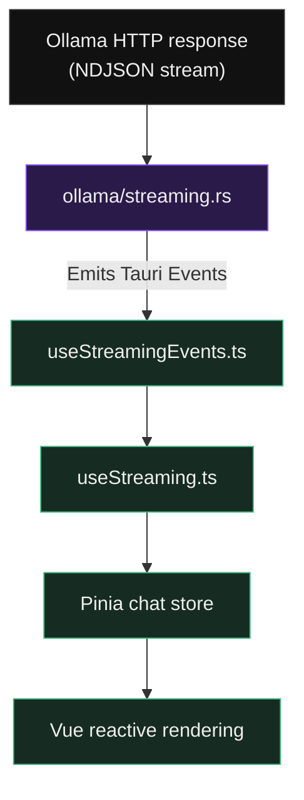

# Backend Reference

The Rust backend lives in `src-tauri/src/`. It follows a strict layering rule: Tauri command handlers in `commands/` are thin adapters — they validate input, call the service layer, and serialize the result. Business logic belongs in `services/`.

## Streaming Pipeline (Deep Dive)

This is the most complex part of the backend. Understanding it is essential before touching chat, tool calls, or thinking block handling.

### Flow



### Think Tag Detection

The `<think>` tag can be split across NDJSON chunk boundaries (e.g. `<thi` in one chunk, `nk>` in the next). `streaming.rs` maintains a small string buffer to handle cross-chunk boundaries. Do not use a single-pass regex for this — it will miss split tags under load.

### Tool Call Parsing

Tool calls arrive as `<tool_call name="..." arguments="{...}">` in the token stream. Parsing extracts the `name` attribute and the JSON `arguments` attribute using secondary regex calls (not a single complex regex — SonarCloud enforces regex complexity < 20).

## Command Registry

All 36 Tauri commands are registered in `src-tauri/src/lib.rs`. To add a new command:

1. Implement the handler in the appropriate file under `commands/`.
2. Annotate with `#[tauri::command]`.
3. Add it to the `generate_handler![]` macro call in `lib.rs`.
4. Add the corresponding `invoke()` call in the frontend TypeScript.

## SQLite Schema

The database is initialised from a single baseline migration at `src-tauri/src/db/migrations/001_init_v1.sql`. There is no migration runner — the schema is applied once on first launch. See `src-tauri/src/db/` for per-table modules.

Key tables: `conversations`, `messages`, `hosts`, `settings`, `model_user_data` (tags, favorites, per-model defaults).

## AppState

`src-tauri/src/state.rs` defines `AppState`, shared across all commands via Tauri's managed state:

```rust
pub struct AppState {
    pub db: DbConn,          // Arc<Mutex<Connection>>
    pub client: reqwest::Client,
    pub cancel_tx: Option<CancelSender>,
    pub health_handles: HealthHandles,
}
```

Access it in a command with `state: tauri::State<'_, AppState>`.
