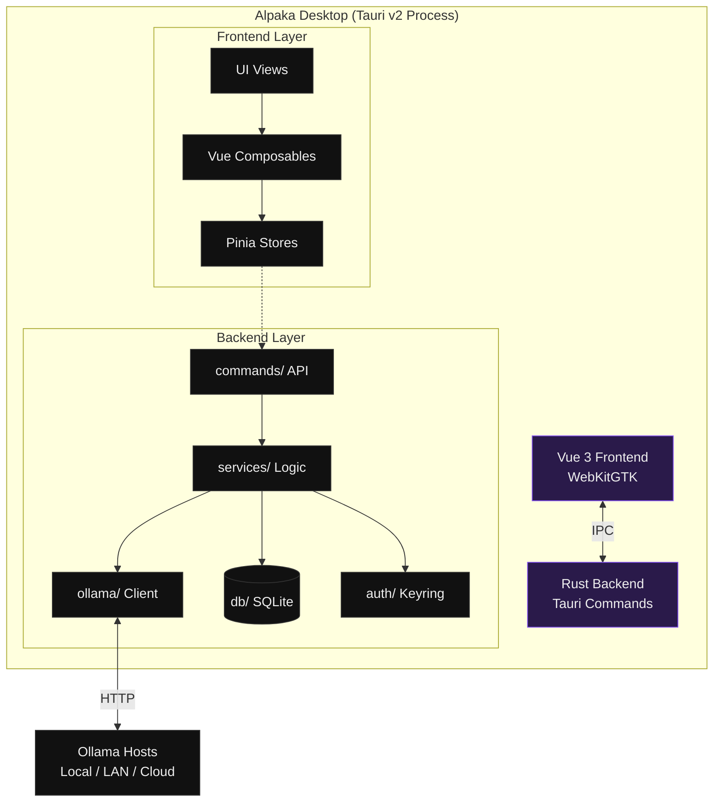

# Architecture Overview

Alpaka Desktop is engineered as a modern, local-first Tauri v2 application. It strictly enforces a separation of concerns between a high-performance Rust backend and a reactive Vue 3 SPA frontend, communicating exclusively via strongly-typed Tauri IPC.

## High-Level Topology

## IPC Communication Patterns

To maintain a responsive 60 FPS UI even under heavy inference load, communication is highly structured:

| Direction | Mechanism | Purpose |
|---|---|---|
| **Frontend → Backend** | `invoke('command', payload)` | Stateful requests (CRUD ops, Settings, Model management). |
| **Backend → Frontend** | `app.emit('event', payload)` | High-frequency telemetry (Streaming tokens, pull progress, health pings). |

## Architectural Decisions

  <SpotlightCard>
    

      <svg width="16" height="16" fill="none" stroke="currentColor" stroke-width="2" viewBox="0 0 24 24"><path stroke-linecap="round" stroke-linejoin="round" d="M13 10V3L4 14h7v7l9-11h-7z"></path></svg>
    

    <h4 class="text-[14px] font-semibold text-[var(--vp-c-text-1)] m-0 mb-1">Why Tauri v2?</h4>
    
Minimal footprint. The final binary is ~8MB and idles at ~60MB RAM, allowing your machine's resources to be fully dedicated to LLM inference instead of an Electron wrapper.

  </SpotlightCard>

  <SpotlightCard>
    

      <svg width="16" height="16" fill="none" stroke="currentColor" stroke-width="2" viewBox="0 0 24 24"><path stroke-linecap="round" stroke-linejoin="round" d="M4 7v10c0 2.21 3.582 4 8 4s8-1.79 8-4V7M4 7c0 2.21 3.582 4 8 4s8-1.79 8-4M4 7c0-2.21 3.582-4 8-4s8 1.79 8 4m0 5c0 2.21-3.582 4-8 4s-8-1.79-8-4"></path></svg>
    

    <h4 class="text-[14px] font-semibold text-[var(--vp-c-text-1)] m-0 mb-1">Local-First Storage</h4>
    
All conversational data is persisted strictly to a local SQLite database (`~/.local/share/alpaka-desktop/`). No data leaves your machine unless you explicitly route it to an external host.

  </SpotlightCard>

  <SpotlightCard>
    

      <svg width="16" height="16" fill="none" stroke="currentColor" stroke-width="2" viewBox="0 0 24 24"><path stroke-linecap="round" stroke-linejoin="round" d="M12 15v2m-6 4h12a2 2 0 002-2v-6a2 2 0 00-2-2H6a2 2 0 00-2 2v6a2 2 0 002 2zm10-10V7a4 4 0 00-8 0v4h8z"></path></svg>
    

    <h4 class="text-[14px] font-semibold text-[var(--vp-c-text-1)] m-0 mb-1">OS Keyring Integration</h4>
    
API keys are never written to SQLite. They are securely injected into the Secret Service API (KWallet / GNOME Keyring) to prevent unauthorized extraction.

  </SpotlightCard>

## Detailed Reference

For an exhaustive technical breakdown of the command registry, exact database schema, ADRs, and our performance budget, refer to the full [`ARCHITECTURE.md`](https://github.com/nikoteressi/alpaka-desktop/blob/main/docs/ARCHITECTURE.md) in the project root.
