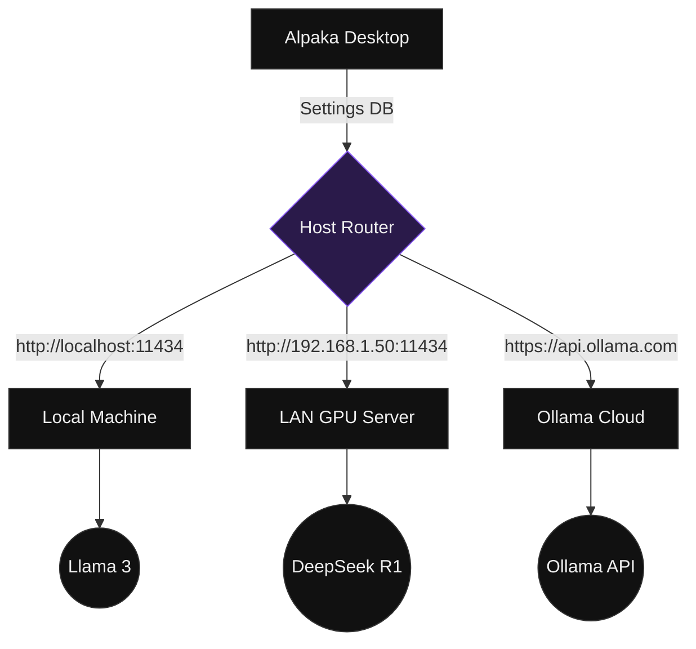

# Multi-Host Management

Alpaka Desktop seamlessly connects to multiple Ollama instances simultaneously. This feature is designed for power users and enterprise teams who need to route workloads between local hardware, dedicated LAN servers, and Ollama Cloud.

  

    

      <svg width="20" height="20" fill="none" stroke="currentColor" stroke-width="1.5" viewBox="0 0 24 24"><path stroke-linecap="round" stroke-linejoin="round" d="M13 16h-1v-4h-1m1-4h.01M21 12a9 9 0 11-18 0 9 9 0 0118 0z"></path></svg>
    

    

      <h4 class="font-medium text-text-1 m-0">Why use Multi-Host?</h4>
      
Offload heavy reasoning models (like DeepSeek-R1) to a dedicated GPU server while running smaller, faster models (like Llama 3) on your local machine for zero-latency tasks.

    

  

## Architecture & Data Flow

When switching hosts, Alpaka routes inference requests to the active host without requiring an application restart. Your chat history, drafts, and system prompts remain unified locally.

## Adding a Host

To connect a new Ollama instance to your workspace:

1. Navigate to **Settings → Hosts** (or use the keyboard shortcut `Ctrl+H`).
2. Click the **Add host** button.
3. Enter the target endpoint URL:
   - For LAN servers: `http://192.168.x.x:11434`
   - For Ollama Cloud: `https://api.ollama.com`
4. Click **Save**. 

*Alpaka Desktop will immediately dispatch a ping to verify connectivity and establish a health baseline.*

## Health Monitoring

Alpaka runs a background telemetry loop that continuously monitors the health of all configured hosts. Status indicators are displayed globally in the top navigation bar:

- 🟢 **Online:** The host is reachable. Network latency is displayed in milliseconds.
- 🔴 **Offline:** The host failed to respond or connection timed out.
- ⚪ **Unknown:** The host has not yet been pinged by the telemetry loop.

## Instant Host Switching

To switch the active inference endpoint:

1. Click the **Host Indicator** in the top navigation bar to reveal the quick-switcher dropdown.
2. Select your desired host. 

Upon selection, the Model Manager immediately syncs with the newly active host, reloading the available model registry. Your active conversations remain intact and accessible.

## Authenticating with Ollama Cloud

When `https://api.ollama.com` is configured as a host, Alpaka automatically elevates its security context. 

API keys stored in **Settings → Account → API Keys** (which are securely managed via your OS Keyring) are seamlessly injected as Bearer tokens on all outbound requests to this specific host. Local hosts remain unaffected by this authentication layer.
